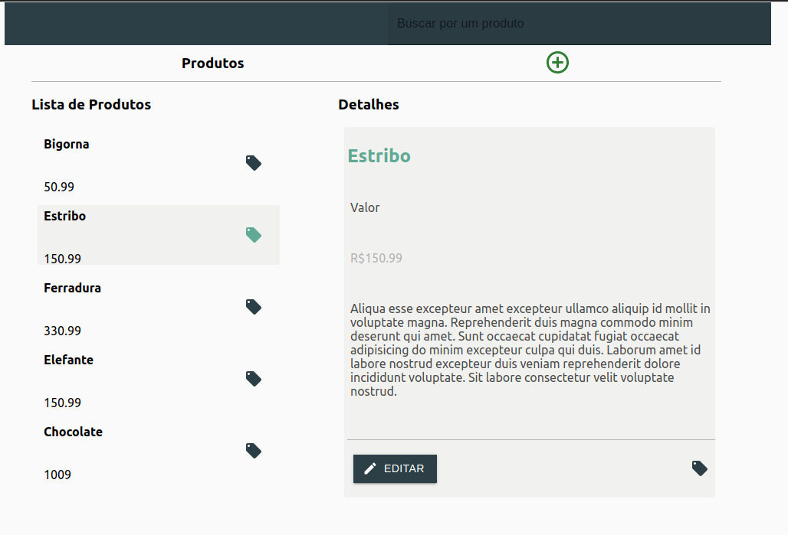

## Desafio FullStack RadarFit

<hr>



### Rodando o backend

```
cd app/backend
npm run dev
```

### Rodando o frontend

```
cd app/frontend
npm start
```

### Rodando o banco de dados

```
cd app/backend
npm run db:reset
```